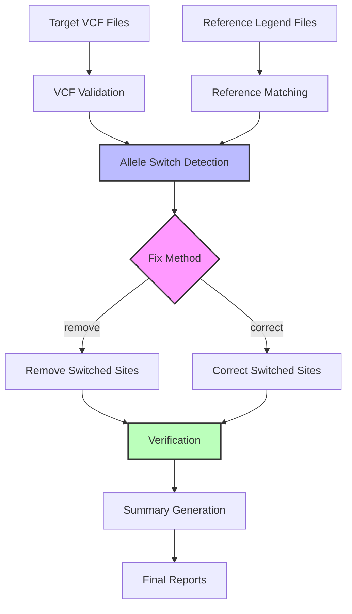
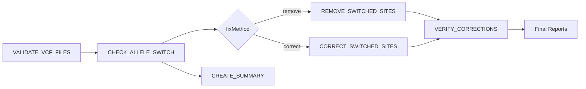

# CheckRef Workflow Overview

CheckRef is a comprehensive Nextflow pipeline for detecting and correcting allele switches between target VCF files and reference panel legend files.

## Pipeline Architecture

## Workflow Steps

### 1. Input Validation (VALIDATE_VCF_FILES)
- Validates VCF file integrity and format
- Checks file accessibility and compression
- Verifies bcftools compatibility
- Generates validation reports

### 2. Reference Matching
- Automatically detects chromosome information from filenames
- Matches target VCF files with corresponding reference legend files
- Validates reference panel structure and format

### 3. Allele Switch Detection (CHECK_ALLELE_SWITCH)
- Compares target VCF variants against reference panel alleles
- Identifies matching, switched, complementary, and other inconsistencies
- Generates detailed switch analysis results
- Creates summary statistics

### 4. Allele Switch Correction
Two correction methods available:

#### Remove Method (REMOVE_SWITCHED_SITES)
- Removes variants with detected allele switches
- Creates cleaned VCF with problematic sites excluded
- Preserves high-quality variants only

#### Correct Method (CORRECT_SWITCHED_SITES)
- Fixes allele switches by swapping REF and ALT alleles
- Adds SWITCHED=1 flag to corrected variants
- Maintains all variants while fixing orientation issues

### 5. Verification (VERIFY_CORRECTIONS)
- Re-analyzes corrected/cleaned VCF files
- Validates that corrections were applied successfully
- Generates verification reports and statistics

### 6. Summary Generation (CREATE_SUMMARY)
- Aggregates results across all processed chromosomes
- Creates comprehensive analysis summaries
- Generates final execution reports

## Data Flow

### Input Data Types

| Data Type | Format | Description |
|-----------|--------|-------------|
| **Target VCF** | VCF.gz | Bgzipped VCF files with variants to analyze |
| **Reference Legend** | Legend.gz | Reference panel legend files with allele data |
| **VCF Index** | TBI | Tabix index files for VCF access |

### Intermediate Files

| File Type | Format | Description |
|-----------|--------|-------------|
| **Switch Results** | TSV | Detailed variant-level switch analysis |
| **Validation Reports** | TXT | VCF file validation status and details |
| **Correction Stats** | TXT | Statistics on correction success/failure |

### Output Files

| File Type | Format | Description |
|-----------|--------|-------------|
| **Corrected VCF** | VCF.gz | Fixed VCF with corrected allele orientations |
| **Cleaned VCF** | VCF.gz | VCF with problematic variants removed |
| **Summary Reports** | TXT/HTML | Comprehensive analysis summaries |

## Process Dependencies

## Parallelization Strategy

### Chromosome-Level Parallelization
- Each chromosome processed independently
- Parallel execution across multiple chromosomes
- Dynamic resource allocation based on VCF file size

### Process-Level Parallelization
- Concurrent validation of multiple VCF files
- Parallel switch detection across chromosomes
- Independent correction/removal operations

## Resource Requirements

### Default Resource Allocation

| Process | CPUs | Memory | Time |
|---------|------|--------|------|
| **VALIDATE_VCF_FILES** | 1 | 2.GB | 30.min |
| **CHECK_ALLELE_SWITCH** | 4 | 16.GB | 8.h |
| **CORRECT_SWITCHED_SITES** | 2 | 8.GB | 4.h |
| **VERIFY_CORRECTIONS** | 1 | 4.GB | 2.h |

### Scaling Guidelines

**Small dataset (1-3 chromosomes):**
- CPUs: 4-8
- Memory: 16-32 GB
- Runtime: 2-6 hours

**Medium dataset (4-10 chromosomes):**
- CPUs: 16-32
- Memory: 64-128 GB
- Runtime: 6-24 hours

**Large dataset (>10 chromosomes):**
- CPUs: 32-64
- Memory: 128-512 GB
- Runtime: 24-72 hours

## Error Handling

### Automatic Retries
- Failed processes automatically retry (up to 3 times)
- Exponential backoff for resource allocation
- Dynamic resource scaling on retry

### Checkpointing
- Intermediate results saved at each major step
- Resume capability from last successful checkpoint
- Work directory preservation for debugging

### Validation Steps
- Input validation before processing
- Output validation after each step
- Quality metrics monitoring

## Performance Optimization

### Tips for Better Performance

1. **Resource Tuning**: Adjust CPU/memory based on data size
2. **Profile Selection**: Choose appropriate execution profile
3. **Work Directory**: Use fast storage for work directory
4. **Container Caching**: Enable container caching
5. **Reference Caching**: Cache reference data locally

### Common Bottlenecks

- **I/O Intensive Steps**: VCF reading/writing operations
- **Memory Intensive Steps**: Large VCF file processing in memory
- **CPU Intensive Steps**: Allele comparison and switch detection algorithms

## Quality Control Metrics

### Per-Chromosome Metrics
- **Overlap Rate**: Percentage of target variants found in reference
- **Match Rate**: Percentage of variants with matching alleles
- **Switch Rate**: Percentage of variants with detected switches

### Workflow-Level Metrics
- **Validation Success**: Percentage of VCF files passing validation
- **Correction Success**: Percentage of switches successfully corrected

## Related Documentation

- [Process Flow](/workflow/process-flow) - Detailed process descriptions
- [Subworkflows](/workflow/subworkflows) - Modular workflow components
- [Resource Usage](/workflow/resources) - Resource optimization guide