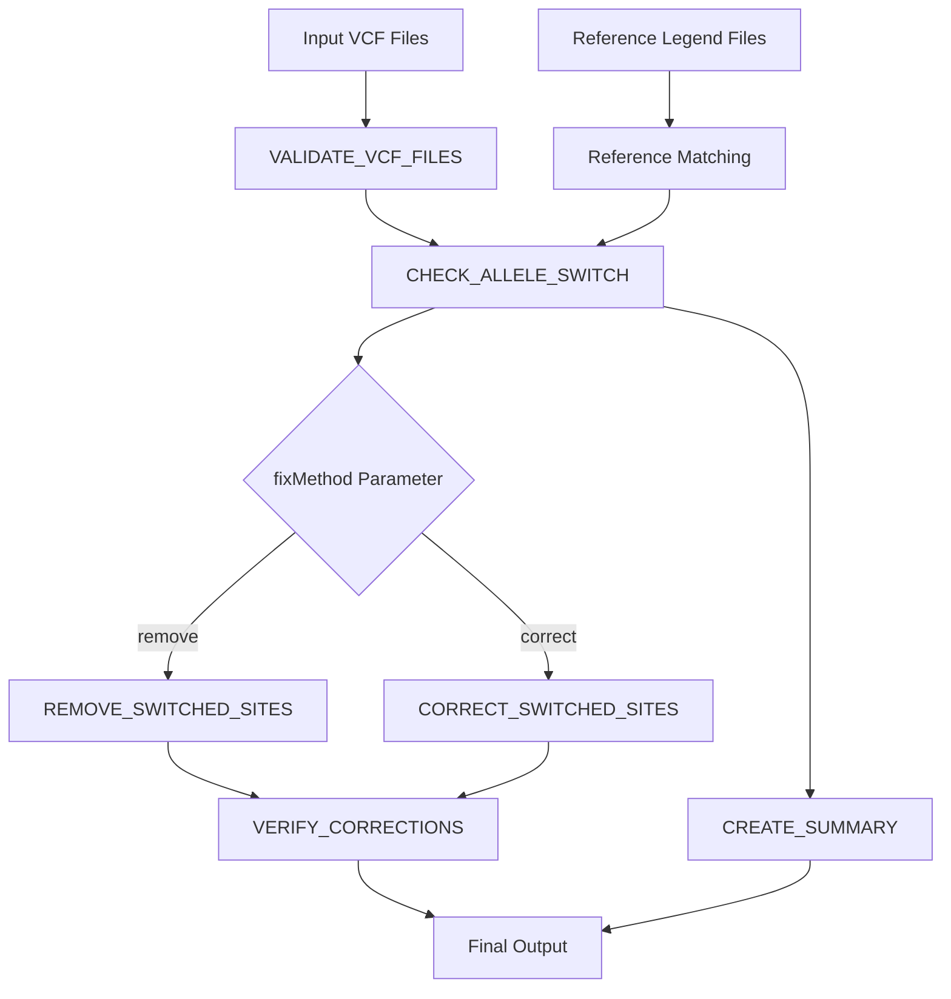

# Process Flow

Detailed description of each process in the CheckRef workflow and their interactions.

## Process Overview

CheckRef consists of six main processes that work together to detect and correct allele switches:



## Process Details

### 1. VALIDATE_VCF_FILES

**Purpose:** Validates input VCF files for integrity and format compliance

**Inputs:**
- Target VCF files (`.vcf.gz`)
- Chromosome identifiers (extracted from filenames)

**Processing Steps:**
1. **File Existence Check**
   ```bash
   if [ ! -f "${vcf_file}" ]; then
       echo "❌ VALIDATION FAILED: File does not exist"
       exit 1
   fi
   ```

2. **File Size Validation**
   ```bash
   FILE_SIZE=$(stat -c%s "${vcf_file}")
   if [ $FILE_SIZE -lt 100 ]; then
       echo "❌ VALIDATION FAILED: File too small"
       exit 1
   fi
   ```

3. **Compression Integrity**
   ```bash
   if ! gzip -t "${vcf_file}"; then
       echo "❌ VALIDATION FAILED: Corrupted compression"
       exit 1
   fi
   ```

4. **VCF Format Validation**
   ```bash
   if ! bcftools view -h "${vcf_file}" > /dev/null 2>&1; then
       echo "❌ VALIDATION FAILED: Invalid VCF format"
       exit 1
   fi
   ```

5. **Data Content Check**
   ```bash
   DATA_LINES=$(bcftools view -H "${vcf_file}" | wc -l)
   if [ $DATA_LINES -eq 0 ]; then
       echo "⚠️ VALIDATION WARNING: No variant data"
   fi
   ```

**Outputs:**
- Validation status files (`chr*_validation_status.txt`)
- Detailed validation reports (`chr*_validation_report.txt`)
- Validated VCF file references for downstream processing

**Error Handling:**
- Failed files are skipped with detailed error reporting
- Workflow continues with remaining valid files
- Comprehensive validation reports generated

### 2. CHECK_ALLELE_SWITCH

**Purpose:** Core analysis process that compares target VCF alleles against reference panel

**Inputs:**
- Validated VCF files
- Matched reference legend files
- Chromosome information

**Processing Steps:**
1. **VCF Variant Extraction**
   ```python
   # Extract SNP variants only
   variants = bcftools_query(vcf_file, format='%CHROM\t%POS\t%REF\t%ALT')
   snp_variants = filter_snps(variants)
   ```

2. **Reference Legend Parsing**
   ```python
   # Parse legend file (auto-detect format)
   legend_data = parse_legend_file(legend_file)
   reference_variants = extract_alleles(legend_data)
   ```

3. **Chromosome Matching**
   ```python
   # Ensure chromosome consistency
   target_chr = extract_chromosome(vcf_filename)
   ref_chr = extract_chromosome(legend_filename)
   validate_chromosome_match(target_chr, ref_chr)
   ```

4. **Allele Comparison**
   ```python
   for variant in common_variants:
       target_ref, target_alt = variant.target_alleles
       ref_ref, ref_alt = variant.reference_alleles
       
       if target_ref == ref_ref and target_alt == ref_alt:
           status = "MATCH"
       elif target_ref == ref_alt and target_alt == ref_ref:
           status = "SWITCH"
       elif is_complement(target_ref, ref_ref) and is_complement(target_alt, ref_alt):
           status = "COMPLEMENT"
       elif is_complement(target_ref, ref_alt) and is_complement(target_alt, ref_ref):
           status = "COMPLEMENT_SWITCH"
       else:
           status = "OTHER"
   ```

**Outputs:**
- Detailed switch results (`*_allele_switch_results.tsv`)
- Summary statistics (`*_allele_switch_summary.txt`)
- Switch coordinates for correction processes

### 3. REMOVE_SWITCHED_SITES

**Purpose:** Creates cleaned VCF by removing variants with detected switches

**Inputs:**
- Original VCF files
- Switch detection results

**Processing Steps:**
1. **Switch Site Identification**
   ```bash
   # Extract positions of switched variants
   awk '$7=="SWITCH" || $7=="COMPLEMENT_SWITCH" {print $1"\t"($2-1)"\t"$2}' \
       switch_results.tsv > exclude_sites.bed
   ```

2. **VCF Filtering**
   ```bash
   # Remove switched sites using bcftools
   if [ -s exclude_sites.bed ]; then
       bcftools view -T ^exclude_sites.bed input.vcf.gz -O z -o output.noswitch.vcf.gz
   else
       cp input.vcf.gz output.noswitch.vcf.gz
   fi
   ```

3. **Indexing**
   ```bash
   # Create tabix index
   tabix -p vcf output.noswitch.vcf.gz
   ```

**Outputs:**
- Cleaned VCF file (`*.noswitch.vcf.gz`)
- VCF index file (`*.noswitch.vcf.gz.tbi`)
- Removal statistics

### 4. CORRECT_SWITCHED_SITES

**Purpose:** Fixes allele switches by swapping REF and ALT alleles

**Inputs:**
- Original VCF files
- Switch detection results

**Processing Steps:**
1. **Switch Site Parsing**
   ```python
   # Identify variants needing correction
   switch_sites = parse_switch_results(switch_results_file)
   correction_sites = filter_correctable_switches(switch_sites)
   ```

2. **VCF Processing**
   ```python
   # Process VCF line by line
   for variant in vcf_reader:
       position = f"{variant.chrom}:{variant.pos}"
       
       if position in correction_sites:
           # Swap REF and ALT alleles
           original_ref = variant.ref
           original_alt = variant.alt[0]
           
           variant.ref = original_alt
           variant.alt = [original_ref]
           
           # Add correction flag
           variant.info['SWITCHED'] = 1
           
           corrected_count += 1
   ```

3. **Output Generation**
   ```bash
   # Sort and index corrected VCF
   bcftools sort corrected_temp.vcf.gz -O z -o final.corrected.vcf.gz
   tabix -p vcf final.corrected.vcf.gz
   ```

**Outputs:**
- Corrected VCF file (`*.corrected.vcf.gz`)
- VCF index file (`*.corrected.vcf.gz.tbi`)
- Correction statistics

### 5. VERIFY_CORRECTIONS

**Purpose:** Validates that corrections were applied successfully

**Inputs:**
- Corrected/cleaned VCF files
- Original reference legend files

**Processing Steps:**
1. **Re-analysis**
   ```python
   # Re-run switch detection on corrected VCF
   verification_results = check_allele_switch(corrected_vcf, reference_legend)
   ```

2. **Validation Checks**
   ```python
   # Verify corrections were successful
   remaining_switches = count_switches(verification_results)
   correction_success_rate = calculate_success_rate(original_switches, remaining_switches)
   
   if correction_success_rate > 0.95:
       status = "VERIFICATION PASSED"
   else:
       status = "VERIFICATION WARNING"
   ```

**Outputs:**
- Verification status (`*_verification_results.txt`)
- Success rate statistics
- Quality assessment reports

### 6. CREATE_SUMMARY

**Purpose:** Aggregates results across all processed chromosomes

**Inputs:**
- Individual chromosome summary files
- Correction/removal statistics

**Processing Steps:**
1. **Data Aggregation**
   ```bash
   # Combine all chromosome summaries
   cat chr*_allele_switch_summary.txt > combined_summary.txt
   ```

2. **Statistics Calculation**
   ```python
   # Calculate overall statistics
   total_variants = sum(chromosome_variants)
   total_switches = sum(chromosome_switches)
   overall_switch_rate = total_switches / total_variants
   ```

**Outputs:**
- Combined summary report (`all_chromosomes_summary.txt`)
- Overall statistics
- Final workflow report

## Process Communication

### Data Flow Between Processes

1. **VALIDATE_VCF_FILES → CHECK_ALLELE_SWITCH**
   - Validated VCF file paths
   - Validation status flags

2. **CHECK_ALLELE_SWITCH → REMOVE/CORRECT_SWITCHED_SITES**
   - Switch detection results (TSV format)
   - Summary statistics

3. **REMOVE/CORRECT_SWITCHED_SITES → VERIFY_CORRECTIONS**
   - Processed VCF files
   - Processing statistics

4. **All Processes → CREATE_SUMMARY**
   - Individual summary files
   - Statistics from each step

### Error Propagation

- Failed validation stops processing for that chromosome
- Switch detection failures are reported but don't stop workflow
- Correction failures are logged with detailed error messages
- Verification warnings are flagged for manual review

## Performance Characteristics

### Resource Usage by Process

| Process | CPU Usage | Memory Usage | I/O Pattern |
|---------|-----------|--------------|-------------|
| VALIDATE_VCF_FILES | Low | Low | Sequential read |
| CHECK_ALLELE_SWITCH | High | Medium | Random access |
| REMOVE_SWITCHED_SITES | Medium | Low | Sequential processing |
| CORRECT_SWITCHED_SITES | Medium | Medium | Sequential processing |
| VERIFY_CORRECTIONS | High | Medium | Random access |
| CREATE_SUMMARY | Low | Low | Sequential read |

### Optimization Opportunities

1. **Parallel Processing**: Multiple chromosomes processed simultaneously
2. **Memory Management**: Streaming processing for large VCF files
3. **I/O Optimization**: Efficient file access patterns
4. **Caching**: Reference data caching for repeated access

## Related Documentation

- [Workflow Overview](./index) - High-level workflow description
- [Subworkflows](./subworkflows) - Modular components
- [Resource Usage](./resources) - Resource optimization guide
