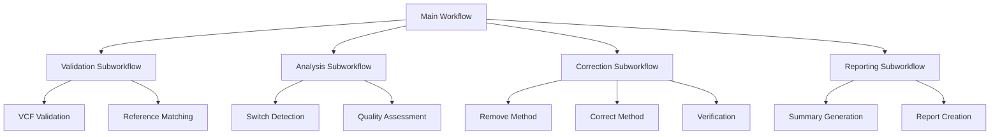

# Subworkflows

CheckRef is organized into modular subworkflows that can be understood and modified independently.

## Subworkflow Architecture



## 1. Validation Subworkflow

**Purpose:** Ensures input data quality and compatibility

### Components

#### VCF Validation Module
```groovy
workflow VCF_VALIDATION {
    take:
    vcf_files_ch
    
    main:
    VALIDATE_VCF_FILES(vcf_files_ch)
    
    emit:
    validated_vcfs = VALIDATE_VCF_FILES.out.validation_results
    validation_reports = VALIDATE_VCF_FILES.out.validation_reports
}
```

#### Reference Matching Module
```groovy
workflow REFERENCE_MATCHING {
    take:
    validated_vcfs
    reference_dir
    
    main:
    // Extract chromosome information
    chromosome_info = validated_vcfs.map { chr, vcf, status -> 
        tuple(chr, vcf, findReferenceFile(reference_dir, chr))
    }
    
    emit:
    matched_pairs = chromosome_info
}
```

### Validation Criteria

| Check Type | Validation Rule | Action on Failure |
|------------|-----------------|-------------------|
| **File Existence** | File must be accessible | Skip file |
| **File Size** | Must be >100 bytes | Skip file |
| **Compression** | Valid gzip format | Skip file |
| **VCF Format** | bcftools readable | Skip file |
| **Data Content** | Contains variant records | Warning only |

### Error Handling Strategy

```groovy
process VALIDATE_VCF_FILES {
    errorStrategy 'ignore'  // Continue with other files
    
    script:
    """
    # Validation with graceful failure
    validate_vcf.sh ${vcf_file} ${chr} || {
        echo "FAILED" > ${chr}_validation_status.txt
        echo "Validation failed for ${vcf_file}" > ${chr}_validation_report.txt
        exit 0  # Don't fail the workflow
    }
    """
}
```

## 2. Analysis Subworkflow

**Purpose:** Core allele switch detection and quality assessment

### Components

#### Switch Detection Module
```groovy
workflow SWITCH_DETECTION {
    take:
    matched_vcf_legend_pairs
    
    main:
    CHECK_ALLELE_SWITCH(matched_vcf_legend_pairs)
    
    emit:
    switch_results = CHECK_ALLELE_SWITCH.out.switch_results
    summary_stats = CHECK_ALLELE_SWITCH.out.summary
}
```

#### Quality Assessment Module
```groovy
workflow QUALITY_ASSESSMENT {
    take:
    switch_results
    
    main:
    // Calculate quality metrics
    quality_metrics = switch_results.map { chr, vcf, results ->
        def stats = parseResults(results)
        def overlap_rate = stats.common_variants / stats.target_variants
        def switch_rate = stats.switched_variants / stats.common_variants
        
        tuple(chr, [
            overlap_rate: overlap_rate,
            switch_rate: switch_rate,
            quality_flag: assessQuality(overlap_rate, switch_rate)
        ])
    }
    
    emit:
    quality_metrics
}
```

### Analysis Parameters

| Parameter | Default | Description | Impact |
|-----------|---------|-------------|--------|
| `min_overlap_rate` | 0.5 | Minimum target-reference overlap | Quality flagging |
| `max_switch_rate` | 0.3 | Maximum acceptable switch rate | Quality flagging |
| `complement_detection` | true | Enable complement strand detection | Analysis scope |

### Quality Flagging Logic

```python
def assess_quality(overlap_rate, switch_rate):
    if overlap_rate < 0.5:
        return "LOW_OVERLAP"
    elif switch_rate > 0.3:
        return "HIGH_SWITCHES"
    elif overlap_rate > 0.7 and switch_rate < 0.15:
        return "EXCELLENT"
    else:
        return "GOOD"
```

## 3. Correction Subworkflow

**Purpose:** Applies corrections based on detected switches

### Components

#### Method Selection Module
```groovy
workflow CORRECTION_DISPATCH {
    take:
    switch_results
    fix_method
    
    main:
    if (fix_method == 'correct') {
        CORRECT_SWITCHED_SITES(switch_results)
        corrected_vcfs = CORRECT_SWITCHED_SITES.out.fixed_vcf
    } else {
        REMOVE_SWITCHED_SITES(switch_results)
        corrected_vcfs = REMOVE_SWITCHED_SITES.out.fixed_vcf
    }
    
    emit:
    corrected_vcfs
}
```

#### Verification Module
```groovy
workflow CORRECTION_VERIFICATION {
    take:
    corrected_vcfs
    reference_legends
    
    main:
    verification_input = corrected_vcfs.join(reference_legends)
    VERIFY_CORRECTIONS(verification_input)
    
    emit:
    verification_results = VERIFY_CORRECTIONS.out.verification_status
}
```

### Correction Strategies

#### Remove Method Strategy
```bash
# Conservative approach - remove problematic variants
remove_strategy() {
    local vcf_file=$1
    local switch_results=$2
    
    # Extract switch positions
    awk '$7=="SWITCH" || $7=="COMPLEMENT_SWITCH" {
        print $1"\t"($2-1)"\t"$2
    }' $switch_results > exclude_sites.bed
    
    # Remove sites
    bcftools view -T ^exclude_sites.bed $vcf_file -O z -o cleaned.vcf.gz
}
```

#### Correct Method Strategy
```python
# Aggressive approach - fix allele orientations
def correct_strategy(vcf_file, switch_results):
    switch_sites = parse_switch_results(switch_results)
    
    with pysam.VariantFile(vcf_file) as vcf_in:
        with pysam.VariantFile('corrected.vcf', 'w', header=vcf_in.header) as vcf_out:
            for record in vcf_in:
                position = f"{record.chrom}:{record.pos}"
                
                if position in switch_sites:
                    # Swap REF and ALT
                    original_ref = record.ref
                    original_alt = record.alts[0]
                    
                    record.ref = original_alt
                    record.alts = (original_ref,)
                    record.info['SWITCHED'] = 1
                
                vcf_out.write(record)
```

### Verification Criteria

| Verification Type | Success Criteria | Action on Failure |
|-------------------|------------------|-------------------|
| **Switch Accuracy** | >95% switches resolved | Warning flag |
| **Allele Frequency** | <5% variants with AF changes | Investigation needed |
| **Format Integrity** | Valid VCF format maintained | Error flag |

## 4. Reporting Subworkflow

**Purpose:** Generates comprehensive analysis reports

### Components

#### Summary Generation Module
```groovy
workflow SUMMARY_GENERATION {
    take:
    individual_summaries
    
    main:
    CREATE_SUMMARY(individual_summaries.collect())
    
    emit:
    combined_summary = CREATE_SUMMARY.out.summary
}
```

#### Report Creation Module
```groovy
workflow REPORT_CREATION {
    take:
    summary_data
    validation_reports
    verification_results
    
    main:
    // Generate HTML report
    generate_html_report(summary_data, validation_reports, verification_results)
    
    emit:
    html_report
}
```

### Report Types

#### Executive Summary
```
====================================
CHECKREF ANALYSIS SUMMARY
====================================
Chromosomes Processed: 3 (chr20, chr21, chr22)
Total Variants Analyzed: 1,234,567
Common Variants: 987,654 (80.0%)
Switches Detected: 12,345 (1.25%)
Correction Method: correct
Corrections Applied: 12,340 (99.96%)
Overall Quality: EXCELLENT
```

#### Detailed Analysis Report
```
Per-Chromosome Results:
- chr20: 456,789 variants, 4,567 switches (1.0%)
- chr21: 345,678 variants, 3,456 switches (1.0%)  
- chr22: 432,100 variants, 4,322 switches (1.0%)

Quality Metrics:
- Average overlap rate: 82.3%
- Average switch rate: 1.0%
- Verification success: 99.96%
```

## Subworkflow Customization

### Adding Custom Validation

```groovy
// Custom validation process
process CUSTOM_VALIDATION {
    input:
    tuple val(chr), path(vcf_file)
    
    output:
    tuple val(chr), path(vcf_file), path("${chr}_custom_validation.txt")
    
    script:
    """
    # Custom validation logic
    custom_validate.py ${vcf_file} > ${chr}_custom_validation.txt
    """
}

// Integrate into validation subworkflow
workflow EXTENDED_VALIDATION {
    take:
    vcf_files_ch
    
    main:
    VALIDATE_VCF_FILES(vcf_files_ch)
    CUSTOM_VALIDATION(VALIDATE_VCF_FILES.out.validation_results)
    
    emit:
    validated_vcfs = CUSTOM_VALIDATION.out
}
```

### Custom Analysis Modules

```groovy
// Population-specific analysis
process POPULATION_ANALYSIS {
    input:
    tuple val(chr), path(vcf_file), path(switch_results)
    val population
    
    script:
    """
    analyze_population_switches.py \\
        --vcf ${vcf_file} \\
        --switches ${switch_results} \\
        --population ${population} \\
        --output ${chr}_population_analysis.txt
    """
}
```

### Custom Correction Methods

```groovy
// Frequency-based correction
process FREQUENCY_CORRECTION {
    input:
    tuple val(chr), path(vcf_file), path(switch_results)
    
    script:
    """
    # Only correct switches with MAF > 0.01
    frequency_based_correction.py \\
        --vcf ${vcf_file} \\
        --switches ${switch_results} \\
        --min-maf 0.01 \\
        --output ${chr}.freq_corrected.vcf.gz
    """
}
```

## Subworkflow Testing

### Unit Testing Individual Modules

```bash
# Test validation subworkflow
nextflow run validation_test.nf \
  --test_vcf test_data/chr22_test.vcf.gz \
  --expected_result PASS

# Test analysis subworkflow  
nextflow run analysis_test.nf \
  --test_vcf test_data/chr22_test.vcf.gz \
  --test_legend test_data/chr22_test.legend.gz \
  --expected_switches 100
```

### Integration Testing

```bash
# Test complete workflow with known data
nextflow run integration_test.nf \
  --test_dataset test_data/integration_test/ \
  --expected_results test_data/expected_results/
```

## Performance Optimization

### Subworkflow-Specific Optimizations

1. **Validation Subworkflow**
   - Parallel validation of multiple files
   - Fast-fail on critical errors
   - Cached validation results

2. **Analysis Subworkflow**
   - Memory-efficient variant processing
   - Parallel chromosome analysis
   - Optimized allele comparison algorithms

3. **Correction Subworkflow**
   - Streaming VCF processing
   - Minimal memory footprint
   - Efficient file I/O

4. **Reporting Subworkflow**
   - Lazy evaluation of reports
   - Compressed intermediate files
   - Parallel report generation

## Related Documentation

- [Process Flow](./process-flow) - Detailed process descriptions
- [Workflow Overview](./index) - High-level architecture
- [Resource Usage](./resources) - Resource optimization
